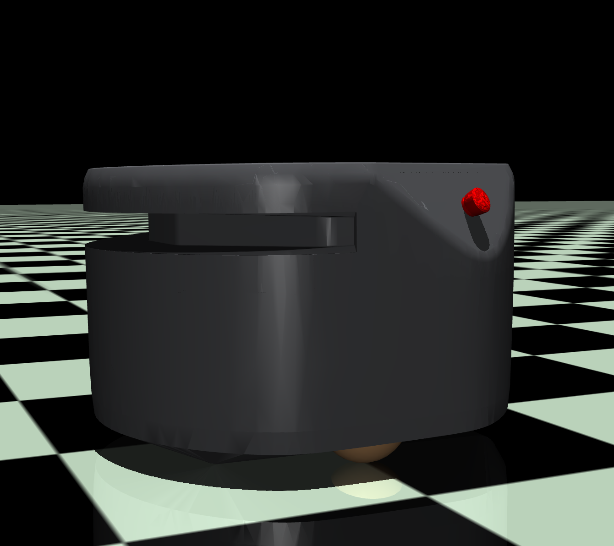

# Fetch Freight Mujoco



Mujoco model for the Fetch Robotics Freight Robot

## Prerequisites

Mujoco 

```bash
pip install mujoco
```

## View Model

```bash
python -m mujoco.viewer --mjcf xml/freight.xml
```

## Note

The conversion did not handle the wheels very well. Therefore I swapped them for ellipsoids primitives.

## Credit

[Dual-UR5-Husky-MuJoCo](https://github.com/wangcongrobot/dual_ur5_husky_mujoco)