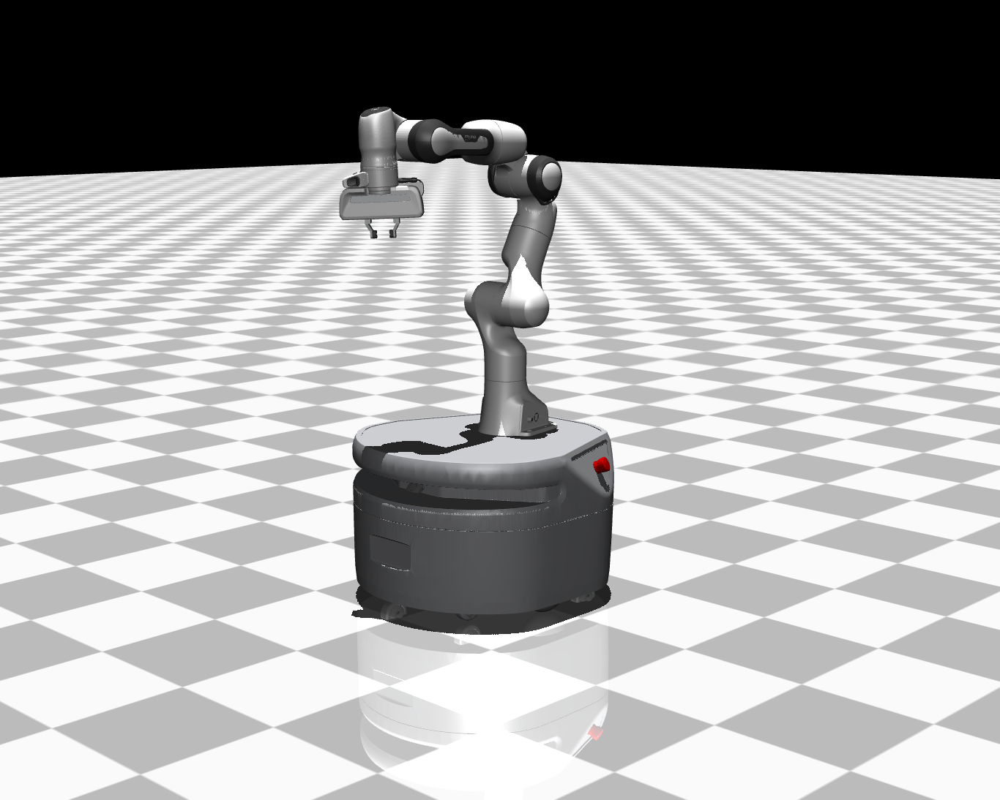

# Fetch Freight Mujoco



Mujoco models for the Fetch Robotics Freight Robot. In particular, we have integrated a Panda arm from Mujoco Menagerie with the mobile base in support of embodied robotics research.

## Prerequisites

Mujoco

```bash
pip install mujoco
```

## View Model

Freight base + Panda arm

```bash
python -m mujoco.viewer --mjcf xml/mobile_manipulator.xml
```

## Notes

### Organization

The robot model is organized hierarchically. Our main entrypoint for the file is `mobile_manipulator.xml`. Inside the main file, we include the Mujoco files containing the mobile base, the Panda arm, and common attributes like collision, meshes, etc.

### Conversion

The conversion did not handle the wheels very well. Therefore I swapped them for ellipsoids primitives.

### I just want the mobile base??

You can simply remove the `<include>` for the panda arm in `freight_panda.xml`.

## Credit

[Dual-UR5-Husky-MuJoCo](https://github.com/wangcongrobot/dual_ur5_husky_mujoco)

[Mujoco Menagerie](https://github.com/google-deepmind/mujoco_menagerie/tree/main)
